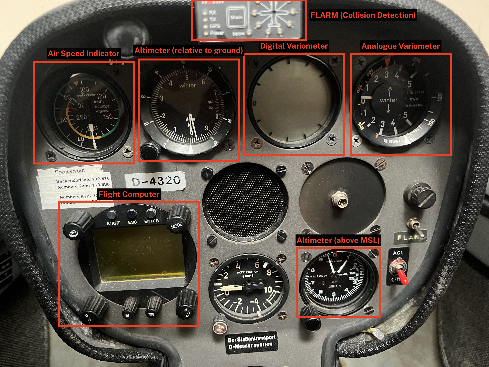
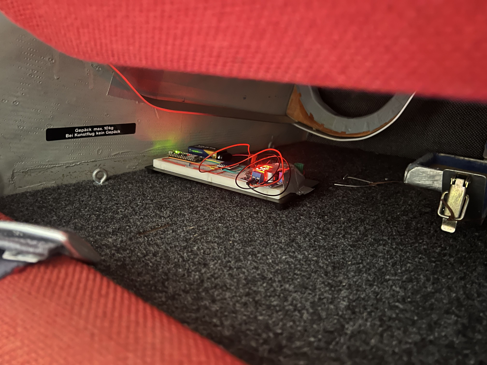
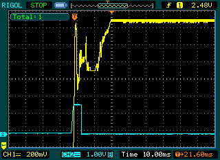
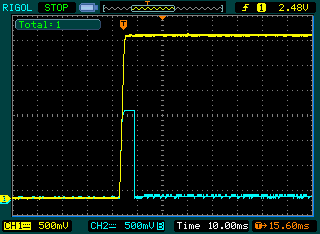
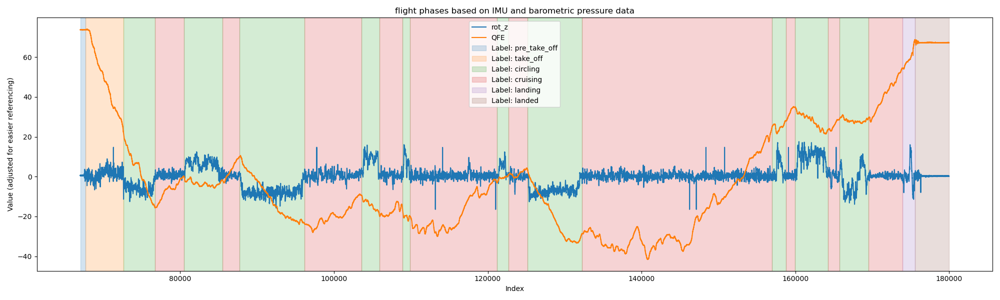
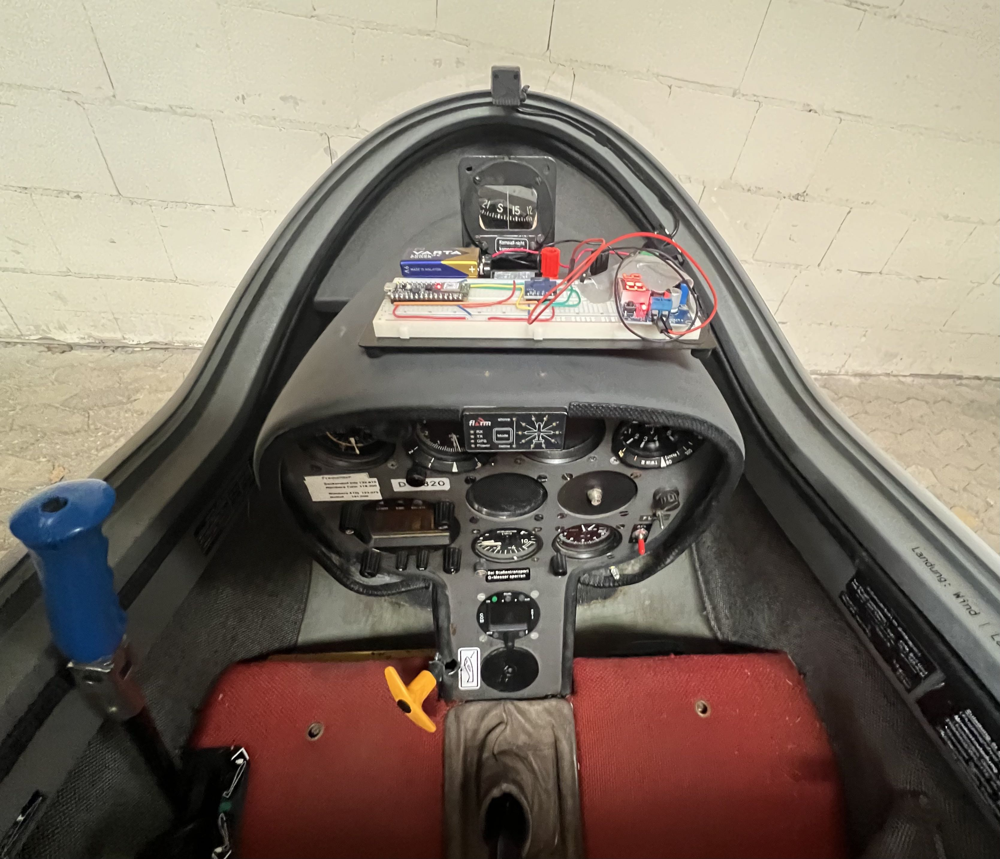

TinyML Summer 2025: Flight Mode Detector
========================================

Code and documentation related to the TinyML course in summer 2025 and the project "Flight Mode Detector".

## Repository Structure

This repo contains the following folders:

| Folder | Description |
| :----: | :---------- |
| [`data-collector`](data-collector/) | Arduino sketch to collect IMU and barometer data during flight onto an SD card. |
| [`classifier`](classifier/) | Flight mode classifier Adruino sketch that uses the trained ML model from Edge Impulse. |
| [`flight-sample-data`](flight-sample-data/) | Collected data used to train the ML classifier. |
| [`assets`](assets/) | Images used in this README. (documentation only) |


## Goal

The goal of this project is to develop a microcontroller that can detect the different flight modes during flight of a [glider/sailplane](https://en.wikipedia.org/wiki/Glider_(sailplane)).
During the duration of one flight, the plane might be in the following flight modes/phases:

- **Pre take-off**: The plane is grounded and ready to take off.
- **Take-off**: The plane is towed by another (motorized) plane until a certain height is reached.
- **Cruising**: The plane is in regular flight on its own. The main goal is to fly as far as possible.
- **Circling**: The plane is flying in circles inside a thermal updraft. The main goal is to gain as much height as possible.
- **Landing**: The plane is ready to land at the nearby airfield.
- **Landed**: The plane is grounded after a successful flight, ready to fly again.

More info on how to soaring works can be found in this [Wikipedia article](https://en.wikipedia.org/wiki/Gliding).

The microcontroller should leverage a machine learning model that is trained to classify these flight modes by relying only on IMU data as well as the current air pressure.
The IMU module measures acceleration and gyroscopic rotation in three axis whilst the pressure sensor measures the barometric pressure of the surrounding air (lower pressure means higher altitude).

### Application

Having information about the current flight mode can have a number of possible applications.
Pilots are mostly occupied with flying the plane and keeping an eye on the on-board instruments.
Not all instruments are equally important during every phase of the flight.
Some of those instruments are analog e.g. the altimeter (current height), variometer (rate of climb and descend indicator, RCDI) and air speed indicator (ASI) whilst others are digital e.g. digital variometer (more on that later), flight computer (for navigation and info on the reachability of the next airfield) and radio (for communication with airfields and other pilots).
This leaves instrument designers and pilots with a dilemma: Keep clean and easy to read instruments with less information density but risk that pilots have to control these and switch between multiple screens during flight or show as much information at once as possible but risk that essential information is harder to spot.
Digital instruments come with the flexibility of adapting to one pilot's individual needs during flight but require their input from time to time, distracting them from flying and causing potential security risks.
This can also lead to pilots "being blind" for a moment, either by having to look at instruments' menus or because their instruments are not showing the information they need in that moment.

This picture shows a set of instruments that are inside a glider's cockpit.



Our approach to this problem is to develop a (tiny) machine learning powered microcontroller that can detect the current flight mode of the plane and control instruments based on that information.
Whilst the actual integration with instruments are outside the scope of this project (mostly due to not being able to modify expensive flight instruments), one could use our model/microcontroller to interface with their instruments at their own discretion.
We will show the detected flight mode using the onboard RGB LED which can easily be adapted to control a 3rd party peripheral or a physical switch on an instrument if it doesn't provide a better interface.
Moreover, we publish the detected flight mode over Bluetooth LE so other applications (e.g. a smartphone flight navigation app) can consume them.
Due to severe size and power restrictions, a microcontroller-based ML model is the perfect solution since it requires little space and can easily be powered using the onboard battery.


### Research Questions

The research questions to answer are:
- R1: Is it possible to detect changes in flight mode using only IMU and pressure sensor data?
- R2: Can these changes be detected reliably?


## Used Components

Our project uses the following hardware components:

- [Arduino Nano 33 BLE Sense](https://docs.arduino.cc/hardware/nano-33-ble-sense/) (Microcontroller with the required sensors)
	- LSM9DS1 (IMU sensor)
	- LPS22HB (barometer)
- SD card module (+ SD card) for collecting training data
- Power converter to convert battery power (9V or 16V) to the required 5V
- Breadboard and jumper wires for prototyping

The following software and platforms have been used:

- Arduino IDE (programming of the microcontroller)
- Python Notebook (analysation and exploration of the collected data)
- Edge Impulse (train and test tiny ML models as well as deploy them to a microcontroller)


## Collecting Data

To train the model, IMU data and pressure data need to be collected during flight.
Whilst Edge Impulse supports data collection out of the box, it can't be used in this context since an active connection to a computer (and the internet) is required.
This can't be realized in a highly space-constrained environment.
To collect data, we created an Arduino [data collection sketch] that reads IMU and pressure data and writes it to the connected SD card for later usage.
We used the same microcontroller and sensors during data collection as well as classification to prevent any mismatches in how different sensors might cause different readings.

The collected data is stored in CSV format and might look like this:

```text
timestamp,acc_x,acc_y,acc_z,rot_x,rot_y,rot_z,qfe,temp
431,0.1,0.09,0.94,0.18,1.95,1.71,988.69,25.04
469,0.11,0.09,0.97,3.05,3.48,1.34,988.66,25.06
507,0.11,0.09,0.97,1.89,2.99,1.4,988.71,25.08
545,0.11,0.09,0.97,1.89,2.81,1.4,988.71,25.1
583,0.11,0.09,0.97,1.77,2.93,1.46,988.68,25.11
...
```

For every measurement, the current timestamp, acceleration and gyroscope readings as well as the current barometric pressure and temperature is logged.
Whilst the sensors would've been capable of a higher sampling rate we were limited by the speed of which the SD card can write data.
However, this wasn't an issue since the plane's movements might only change every few seconds whilst we get data with a frequency of around 25Hz.

To deploy the data collector inside the plane, it has been mounted with Velcro in the back behind the pilot.
The following picture shows the collection unit behind the pilot's headrest.
We were able to log three separate flights like this.



One problem we encountered was that the SD card couldn't initialize when booting up the microcontroller during our tests.
When measuring the power draw of the SD card and comparing it against the SPI clock cycle of the Arduino using an oscilloscope, this happened:



The supplied power over USB from the connected laptop couldn't sustain the initial high current draw of the SD card directly after bootup and the current dropped.
The result is that initialization fails and no data can be collected.
The same happened when using a USB power bank for data collection during flight.

To resolve the issue, we used a dedicated variable power converter that can handle a wide range of input voltages and output a steady and clean 5V for the Arduino and SD card.
Connecting a 9V battery (and in theory the plane's onboard battery), there were no issues in initializing the SD card anymore.
The oscilloscope shows a clean voltage supply when booting up.



(Thanks to the group behind us that was kind enough to lend us their power converter during the course of this project!)


## Analyzing Data

After collection, the data has been analyzed using the provided Python Notebook.
Since the most useful modes of flight are *circling* (to gain height) and *cruising* (to gain distance), we will focus our classification on these first.
The modes *take-off* and *landing* have both been labelled *cruising* as well since the plane is mostly flying in a straight line or curves and not circling like inside thermals.
A third mode *grounded* has been introduced that combines both *pre take-off* and *landed* since those can't be distinguished from one another without taking the history of the captured flight modes into account.

Looking at the data, one can see (apart from noisy sensor readings) that the most prominent difference during *circling* and *cruising* can be found in the gyroscope readings.
The following graph shows the barometric pressure (QFE) and rotation around the Z-axis (as well as the manually labelled flight modes for visualization.



The data has been labelled manually in reference to a separately collected GPS trace from the onboard flight tracker.
Whenever the plane was taking tight turns over a period of time, the plane was considered *circling*, otherwise the plane was *cruising*.
The labelled data has then be split into multiple chunks for each label in order to import them in Edge Impulse.
A total of 56 samples with a combined duration of over 5.5 hours during three separate flights has been collected and labelled.


## Training the Classifier

After data collection and analysis we trained the ML model using Edge Impulse.
The model that can distinguish between the three mentioned classes can be found here: https://studio.edgeimpulse.com/studio/736482

The created impulse uses a window of one second with a stride of one second to chunk the data into equal windows.
Barometric pressure (QFE) is used as a raw feature since its values are fairly clean and can easily be scaled down into a usable range.
The gyroscope data has been fed through spectral analysis in order to extract features related to the rate and magnitude of change in the rotational speed of the plane.
This indicates a change in direction of the plane when flying curves or circles.
Moreover, a low-pass filter with a cut-off frequency of 10Hz has been applied in order to remove any noise that doesn't carry meaning.
The same has been done for the acceleration data but since it didn't give any real improvements over the classification, only the barometric pressure and gyroscope data has been used in the final classifier.

The architecture of the classifier consists of 59 input nodes from the extracted features and three dense layers containing 30, 20 and 10 neurons.
Three output classes indicate the probabilities of the most likely flight mode.
In total, the accuracy during training validation is 93.8% with the following confusion matrix:

|              | **Circling** | **Cruising** | **Grounded** |
| :----------- | :----------: | :----------: | :----------: |
| **Circling** | 83.2% | 16.3% | 0.5% |
| **Cruising** | 9.5% | 89.0% | 1.5% |
| **Grounded** | 0% | 0.6% | 99.4% |
| **F1-Score** | 0.85 | 0.88 | 0.99 |

When testing using a separate testing set (split was an average 70% / 30% on the total data), the accuracy was 91.44% with the following confusion matrix:

|              | **Circling** | **Cruising** | **Grounded** | **Uncertain** |
| :----------- | :----------: | :----------: | :----------: | :-----------: |
| **Circling** | 80.6% | 13.8% | 0.5% | 5.2% |
| **Cruising** | 11.1% | 74.8% | 3.8% | 10.3% |
| **Grounded** | 0.1% | 1.6% | 97.9% | 1.5 % |
| **F1-Score** | 0.81 | 0.79 | 0.98 | -- |

These values are based on the unoptimized (float32-based) model.
Using the quantized (int8) model, the accuracies didn't show any real change, which is great for memory and speed efficiency.

Whilst the overall accuracy is fairly good, the biggest issues were differentiating between *circling* and *cruising* --- the main flight modes we want to distinguish.
After testing the classifier during a real flight the reason became obvious.
Whilst circling the pilot stops and flies straight for a brief period of time in order to re-center the plane in the thermal updraft.
During these short parts of flying straight, the classifier detects the plane as *cruising*.
These adjustments usually last only for a few seconds.

Therefore, a plausibility check has been implemented after classification on the microcontroller since in reality, flight modes can't change back and forth too quickly (think of this as a low-pass filter on the classification results).
It always looks at the last five classifications and only changes the detected flight mode when at least 3/5 classes are equal.
Otherwise, the last detected classification is kept.
Moreover, when classifying one window, the probability of one class needs to be above 50% (instead of 33% to be the most likely class out of three) in order to be used and trigger a change.
This smooths the outputs significantly and makes the detection more robust.

After success with detecting three different classes, we also tried to train a classifier that takes *take-off* and *landing* into account.
Sadly, the accuracy of those two classes wasn't satisfactory.
Only 25.9% of *landing* and 44.8% of *take-off* were classified correctly whilst the false negatives counted towards *circling* and *cruising*.
This can be explained by the little detail between regular flying and take-off (which is essentially flying, only behind a tow plane) and landing (which is also regular flying with tight turns to follow the landing pattern).
The 5-way-classifier can be found here: https://studio.edgeimpulse.com/studio/739653


## Deployment

For testing, the microcontroller has been deployed inside the plane above the instruments and mounted using a Velcro strap underneath.
The following picture shows the board inside the plane:



The final board with all components looks like this:


One live test has been conducted to verify the findings from the test data.
Very unfortunately, we weren't able to take a video during flight since the camera would block part of the pilot's view which has been denied by the flight instructor due to obvious safety reasons.
Holding a camera with one hand whilst flying with the other has also been regarded a bad idea.
Instead, the pilot looked at the onboard LED during flight which changed color based on the currently detected flight mode (red for *grounded*, green for *cruising*, blue for *circling*).


## Conclusion

Overall, the project has been successful!
We could show that IMU and barometric pressure data can be used to distinguish between the flight modes *circling* and *cruising* without much difficulty.
R1 and R2 can therefore be both answered with yes as long as the flight modes are different enough and plausibility checks are leveraged to smooth out any misclassification.

One future application of this project could be to interface with an existing instrument in order to leverage the detected flight mode and adjust the instrument as needed during that phase of flight.
This could e.g. be done with the digital variometer that supports two modes

- **Rate of climb and descend**: Beeps in various pitches and frequencies indicate climbing (high pitch and frequency) or descend (low humming).
- **Optimal airspeed**: Noised of high or low pitch indicate a suggestion of faster (high pitch) or slower (low pitch) airspeed to have an optimal balance between airspeed and corresponding drag to fly with optimal efficiency.

Typically, the pilot switches between these two modes during circling (rate of climb and descend) and cruising (optimal airspeed) using a physical switch.
This could be modified and controlled using the microcontroller and a relay (and the trust of whoever owns the plane that nothing will break) in order to automatically switch the digital variometer mode when the flight modes change.
